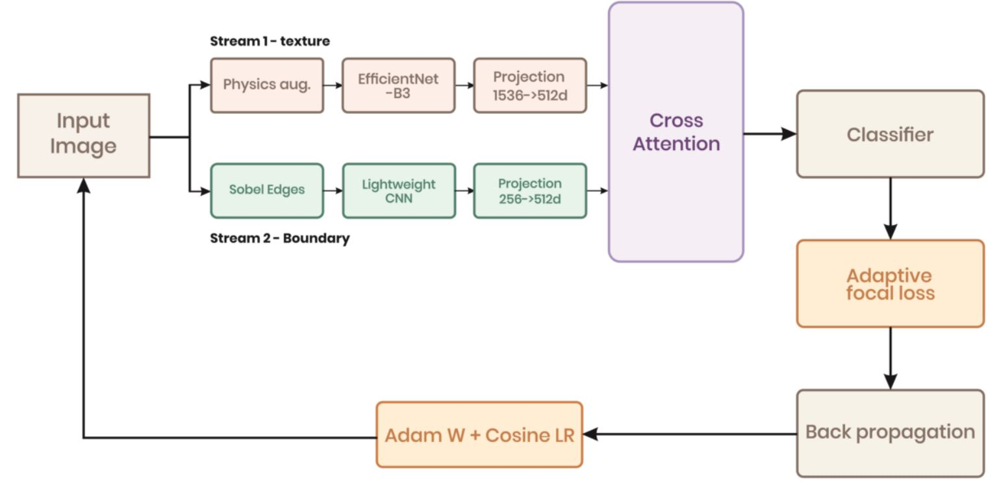

# HADS-Net: Hybrid Attention-Augmented Dual-Stream Network for Breast Ultrasound Classification

[](https://www.python.org/)
[](https://pytorch.org/)
[](https://www.kaggle.com/datasets/aryashah2k/breast-ultrasound-images-dataset)
[]()
[]()
[](LICENSE)

> A novel dual-stream deep learning architecture for three-class breast ultrasound image
> classification (benign, malignant, normal) combining physics-informed augmentation,
> Sobel edge-based boundary features, and cross-attention fusion.

---

## Table of Contents

- [Overview](#overview)
- [Architecture](#architecture)
- [Dataset](#dataset)
- [Results](#results)
- [Requirements](#requirements)
- [Project Structure](#project-structure)
- [Usage](#usage)
- [Key Design Choices](#key-design-choices)
- [Citation](#citation)

---

## Overview

Breast ultrasound classification is a challenging problem due to low image contrast,
speckle noise, acoustic shadowing, and significant visual overlap between benign and
malignant lesions. HADS-Net addresses three gaps in the existing literature:

1. **No physics-informed augmentation** — prior methods use generic photographic
   augmentation that ignores the physics of ultrasound image formation.
2. **No dedicated boundary stream** — lesion boundary features are clinically the most
   diagnostically significant cue, yet no prior architecture dedicates a separate stream
   to them.
3. **No cross-attention between complementary modalities** — prior attention methods
   apply self-attention within a single stream rather than querying across streams.

HADS-Net solves all three by combining:
- **Physics-informed augmentation** (speckle noise, acoustic shadowing, gain variation)
- **Dual-stream architecture** (EfficientNet-B3 for texture + lightweight CNN for edges)
- **Cross-attention fusion** (texture stream queries boundary stream)
- **Adaptive class-weighted focal loss** (handles 3.3:1.6:1 class imbalance)

---

## Architecture



The training pipeline consists of two parallel streams:

| Stream | Input | Backbone | Output |
|--------|-------|----------|--------|
| Stream 1 — Texture | Physics-augmented image | EfficientNet-B3 (pretrained) | 1536-d → 512-d |
| Stream 2 — Boundary | Sobel edge map | Lightweight 4-stage CNN | 256-d → 512-d |

Both 512-d representations are fused via an **8-head cross-attention module** where
the texture stream serves as the query and the boundary stream as the key–value pair.
The fused vector is passed to an MLP classifier trained with **adaptive focal loss**
(γ = 2.0, inverse-frequency class weights).

Training uses **5-fold stratified cross-validation** over 50 epochs with AdamW
(lr = 1e-4, weight decay = 1e-4) and cosine annealing LR schedule. The globally best
checkpoint is selected by lowest validation loss across all folds and epochs.

---

## Dataset

The **Breast Ultrasound Images (BUSI)** dataset contains 780 ultrasound images
collected from 600 female patients aged 25–75.

| Class | Count | Percentage |
|-------|-------|------------|
| Benign | 437 | 56.0% |
| Malignant | 210 | 26.9% |
| Normal | 133 | 17.1% |
| **Total** | **780** | **100%** |


**Train / Test Split (85% / 15%, stratified):**

| Class | Train | Test |
|-------|-------|------|
| Benign | 371 | 66 |
| Malignant | 179 | 31 |
| Normal | 113 | 20 |
| **Total** | **663** | **117** |


Download the dataset from Kaggle:
[BUSI Dataset](https://www.kaggle.com/datasets/aryashah2k/breast-ultrasound-images-dataset)

---

## Results

### Test Set Performance

| Metric | Score |
|--------|-------|
| **Accuracy** | **96.58%** |
| **Macro ROC-AUC** | **0.9978** |
| **Macro F1-score** | **0.9654** |

### Per-Class Metrics

| Class | Precision | Recall | F1-Score | Support |
|-------|-----------|--------|----------|---------|
| Benign | 0.97 | 0.97 | 0.970 | 66 |
| Malignant | 0.97 | 0.94 | 0.951 | 31 |
| Normal | 0.95 | 1.00 | 0.976 | 20 |

> ✅ No malignant case was misclassified as normal — the most dangerous clinical error.


### Confusion Matrix & F1 Scores


### Training Curves

Global best checkpoint: **Fold 1, Epoch 44** (validation loss = 0.0693)
Mean 5-fold validation loss: **0.1075 ± 0.0300**


### Comparison with State-of-the-Art (BUSI Dataset)

| Method | Accuracy (%) | AUC |
|--------|-------------|-----|
| MobileNetV2 | 50.0 | — |
| InceptionV3 | 84.0 | — |
| ResNet50 | 85.0 | — |
| ResNet + CAM | 83.5 | 0.887 |
| Fuzzy Ensemble (VGG+DenseNet+Inception+Xception) | 85.23 | — |
| EfficientNet | 85.6 | — |
| VGG19 + Preprocessing | 87.8 | 0.950 |
| EDCNN (MobileNet + Xception) | 87.82 | 0.910 |
| Vision Transformer | 88.6 | — |
| EfficientKNN | 94.0 | — |
| ViT-B32 | 95.0 | — |
| MobileNet + DenseNet + CBAM | — | 0.9834 |
| **HADS-Net (Ours)** | **96.58** | **0.9978** |

---

## Requirements

```bash
pip install torch torchvision timm albumentations opencv-python \
            scikit-learn matplotlib pandas numpy
```

Or install from the requirements file:

```bash
pip install -r requirements.txt
```

**Tested with:**

```
Python        3.10+
PyTorch       2.0+
timm          0.9+
albumentations 1.3+
scikit-learn  1.3+
```

---

## Project Structure

```
HADS-Net/
│
├── busi-classification.ipynb   # Main notebook (end-to-end pipeline)
│
├── assets/                     # All output figures
│   ├── pipeline.png            # Architecture diagram
│   ├── class_distribution.png  # Dataset class counts
│   ├── sample_images.png       # Sample images per class
│   ├── train_test_split.png    # 85/15 split visualisation
│   ├── loss_accuracy_curves.png # 5-fold training curves
│   ├── best_fold_loss.png      # Best fold (Fold 1) loss curve
│   ├── test_evaluation.png     # Confusion matrix + F1 + loss bar
│   └── classification_report.png # Test set report
│
├── README.md
└── LICENSE
```

---

## Usage

### Run on Kaggle

1. Upload `busi-classification.ipynb` to a new Kaggle notebook.
2. Add the BUSI dataset as input:
   `Datasets → Search → "Breast Ultrasound Images Dataset"`
3. Enable GPU accelerator under **Settings → Accelerator → GPU T4 x2**.
4. Run all cells in order.

### Run Locally

```bash
# 1. Clone the repository
git clone https://github.com/<your-username>/HADS-Net.git
cd HADS-Net

# 2. Install dependencies
pip install -r requirements.txt

# 3. Update the dataset path in Cell 2
# Change: base_path = '/kaggle/input/...'
# To:     base_path = '/your/local/path/Dataset_BUSI_with_GT'

# 4. Launch Jupyter
jupyter notebook busi-classification.ipynb
```

### Notebook Cell Guide

| Cell | Purpose |
|------|---------|
| 0–1 | Imports and setup |
| 2–3 | Load dataset, count classes |
| 4 | Plot class distribution |
| 5 | Visualise sample images |
| 6–7 | Train/test split and visualisation |
| 8 | Install dependencies and model imports |
| 9 | Physics-informed augmentation functions |
| 10 | Sobel edge extraction + Dataset class |
| 11 | HADS-Net architecture (CrossAttentionFusion + HADSNet) |
| 12 | Adaptive focal loss |
| 13 | 5-fold cross-validation training loop |
| 14 | Validation metrics (AUC, F1, classification report) |
| 15 | Train vs val curves across all folds |
| 16 | Best fold train vs val loss |
| 17 | Test set inference with global best checkpoint |
| 18 | Test evaluation plots |

---

## Key Design Choices

### Physics-Informed Augmentation
Three ultrasound-specific augmentations simulate real acquisition artefacts:

- **Speckle noise** — Gaussian noise modelling coherent wave interference
- **Acoustic shadowing** — darkened vertical strip below highly reflective structures
- **Gain variation** — depth-dependent brightness ramp simulating operator TGC settings

These are applied stochastically during training only and are disabled at inference.

### Cross-Attention Fusion
The texture stream (EfficientNet-B3) queries the boundary stream (edge CNN):

```
Q = W_Q × f_texture    # texture features as query
K = W_K × f_boundary   # boundary features as key
V = W_V × f_boundary   # boundary features as value

z = LayerNorm(W_O × concat(softmax(QK^T / √d_k) × V) + f_texture)
```

The residual connection preserves texture information when boundary features are uninformative.

### Global Best Checkpoint
The saved model is the one with the **lowest validation loss across all 5 folds
and all 50 epochs**, not just the best within each fold. This ensures the final
model corresponds to the epoch of best generalisation regardless of which fold
produced it.

---

## Citation

If you use this code or find it helpful in your research, please cite:

```bibtex
@article{hadsnet2025,
  title   = {HADS-Net: A Hybrid Attention-Augmented Dual-Stream Network
             with Physics-Informed Augmentation for Breast Ultrasound
             Image Classification},
  author  = {[Your Name]},
  journal = {[Target Journal]},
  year    = {2025}
}
```

---

## Acknowledgements

- Dataset: Al-Dhabyani et al., *Data in Brief*, 2020 —
  [BUSI Dataset](https://doi.org/10.1016/j.dib.2019.104863)
- Backbone: Tan & Le, EfficientNet, ICML 2019
- Loss: Lin et al., Focal Loss, ICCV 2017
- Optimiser: Loshchilov & Hutter, AdamW, ICLR 2019

---

## License

This project is licensed under the MIT License.
See [LICENSE](LICENSE) for details.
